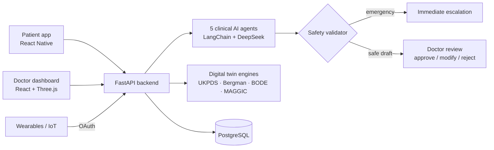

# MedTwin — AI Medical Digital Twin Platform

> **Graduation Project 2026 · Egypt University of Informatics · Grade: A+**
> Team Lead: **Basmala Yasser Ahmed** · Developed with **AI Empower Egypt (Dell Technologies & MCIT)** · Clinical validation with **AstraZeneca**

MedTwin builds a **living, simulated model of each patient** (a "digital twin") and uses it to support consultation, monitoring, and early warning for three chronic conditions: **Type 2 Diabetes, COPD, and Heart Failure**.

> 🔒 **This is a showcase repository.** The full source code is private. Code walkthroughs are available on request for interviews.

---

## ✨ What it does

| Feature | Description |
|---|---|
| 🧬 **Digital twin per patient** | Published physiology models (UKPDS, Bergman glucose minimal model, BODE, MAGGIC) evolve each patient's simulated state and project risk trajectories |
| 🤖 **AI consultation** | **5 clinical AI agents** (symptom Q&A, analysis, planning, prediction, notifier) run a structured interview and produce drafts that a **doctor reviews and approves** |
| 🛡️ **Clinical safety layer** | Every AI output passes a validator: **emergency detection, hallucination prevention, confidence scoring**, and a mandatory "Clinical Bottom Line" |
| 👩‍⚕️ **Doctor & patient apps** | Doctor dashboard (patients, consultations, analytics, twin view) and patient flows (AI interview, health monitor, 3D twin viewer) |
| ⌚ **IoT / wearables** | OAuth-based ingestion of remote-monitoring data into the twin |

## 🏗️ Architecture



**Consultation lifecycle:** `draft → pending_choice → analyzing → under_review → approved / modified / rejected → complete`

## 📊 Evaluation results

All results come from running the **production code** on public datasets or labelled test cases.

| What was tested | Data | Result |
|---|---|---|
| Emergency triage safety | 23 labelled cases (13 emergency / 10 routine) | **Sensitivity 1.00 · Specificity 1.00** |
| Heart-failure mortality risk (MAGGIC) | UCI Heart Failure Records, n = 299 | **ROC AUC 0.771** (95% CI 0.712–0.827) |
| Diabetes CVD mortality risk (UKPDS 56) | NHANES 2013–2014, n = 631 | **ROC AUC 0.676** |
| COPD severity (BODE) | COPD cohort, n = 100 | ρ ≈ 0.46 vs CAT & SGRQ (p < 10⁻⁵), AUC 0.73 |
| Reference-equation fidelity | Hand-computed reference patients | **4 / 4 checks pass** |

> The triage evaluation also uncovered and fixed a real gap: the phrase *"lips turning blue"* was not being escalated.

## 🧰 Tech stack

- **Backend:** Python · FastAPI · SQLAlchemy + Alembic · LangChain · DeepSeek · JWT + CSRF
- **Frontend:** React 19 · Vite · MUI v7 · TanStack Query · Three.js / react-three-fiber
- **Mobile:** Expo · React Native
- **Data:** PostgreSQL
- **DevOps:** Docker (full stack) · CI/CD · ~78 pytest test modules · Caddy with automatic HTTPS

## 📸 Screenshots

<!-- Add screenshots here: drag images into GitHub's editor -->
| Doctor dashboard | 3D digital twin | AI consultation |
|---|---|---|
| _screenshot_ | _screenshot_ | _screenshot_ |

## 🔍 Code sample — safety gate pattern

A simplified illustration of how every AI response is gated before it reaches a user:

```python
def deliver(agent_output, patient):
    report = validator.check(agent_output, patient)

    if report.emergency:
        return escalate_immediately(patient, report.reason)

    if report.hallucination_flags or report.confidence < MIN_CONFIDENCE:
        return request_doctor_review(agent_output, report)

    return create_draft_for_approval(agent_output, report.clinical_bottom_line)
```

## 👩‍💻 My role

- Led a team of three from design to deployment
- Designed the multi-agent consultation flow and the clinical safety validator
- Built backend APIs, evaluation scripts, and Docker/CI setup

---

📫 **Basmala Yasser Ahmed** · [LinkedIn](https://www.linkedin.com/in/basmala-yasser-837008289) · [GitHub](https://github.com/basmalaemara)

© 2026 Basmala Yasser Ahmed. All rights reserved. This repository is for portfolio viewing only.
